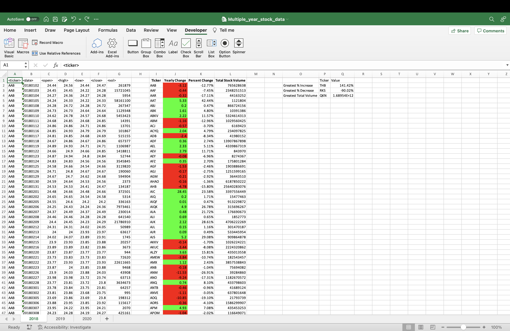
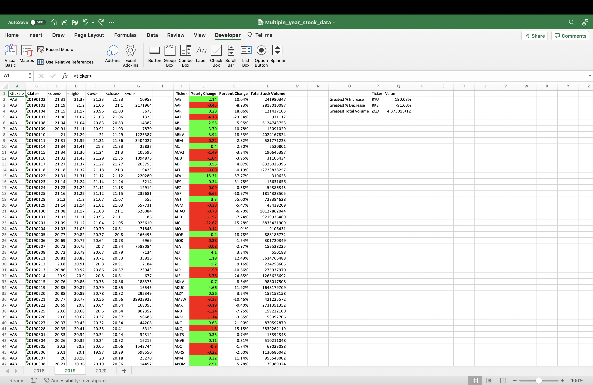
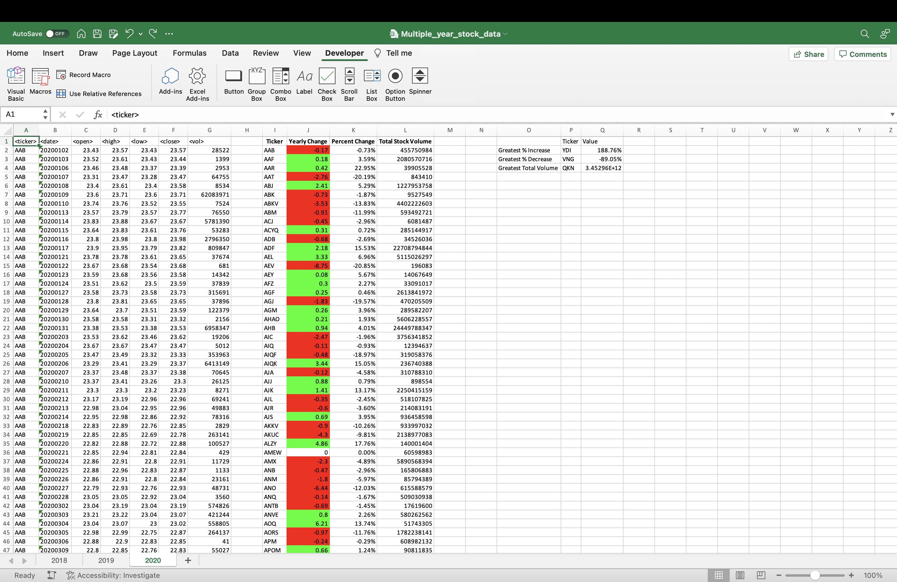

# VBA-challenge
Module 2 Challenge Assignment
 
Glen Dagger
 

I'm including screenshots for partial results of each worksheet in the Multiple_year_stock_data.xlsm file below (idea borrowed from Omar Espinoza, all work was otherwise completed independently.)

I have also exported the VBA script as "StockMarketVBAScript.vbs" separately to this repository, along with the screenshot .png files.
 
 

## Results for 2018

 

## Results for 2019

 

## Results for 2020
